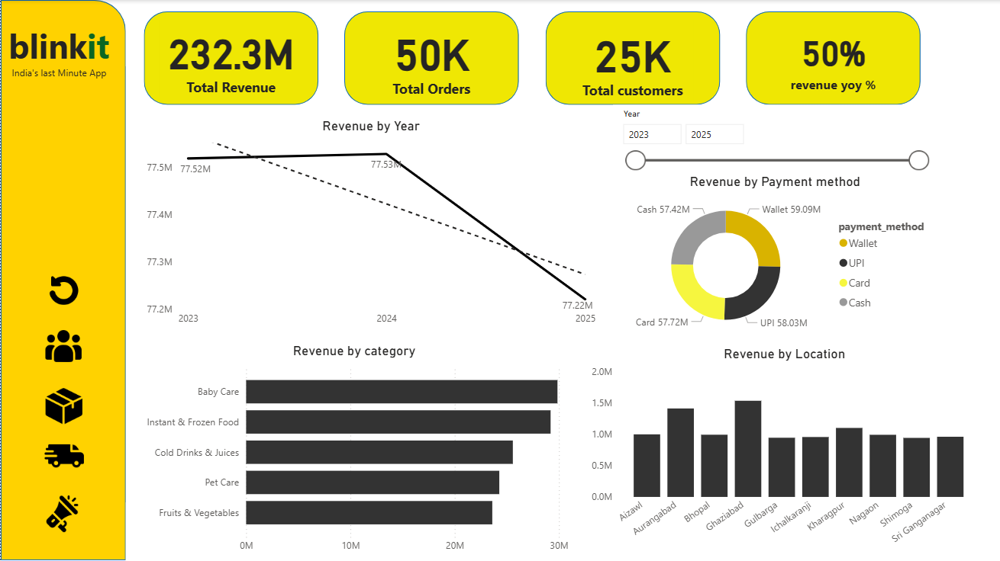
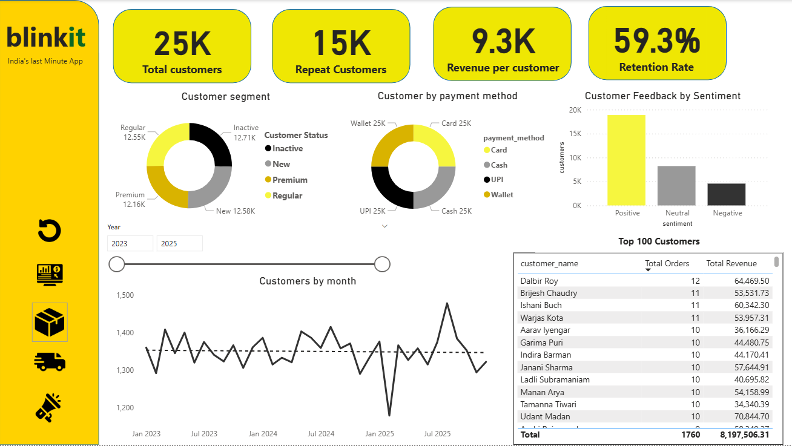
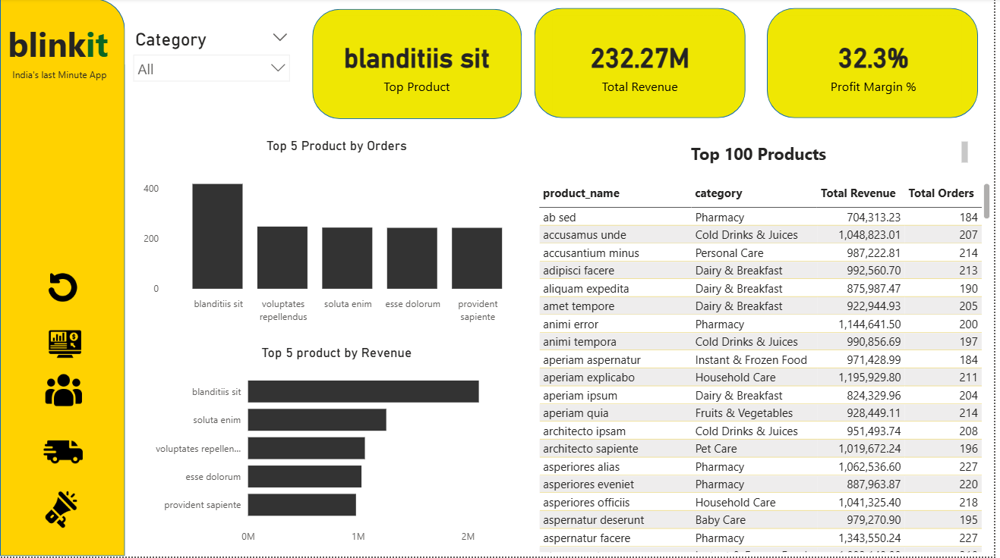
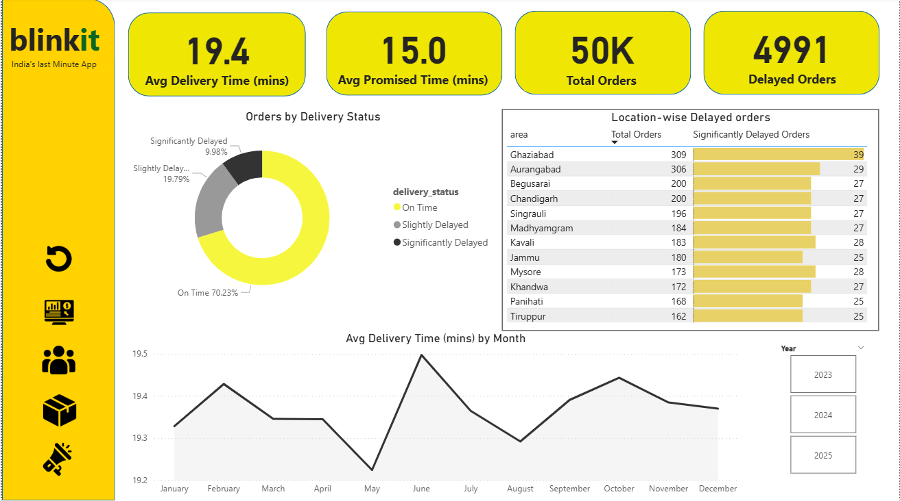
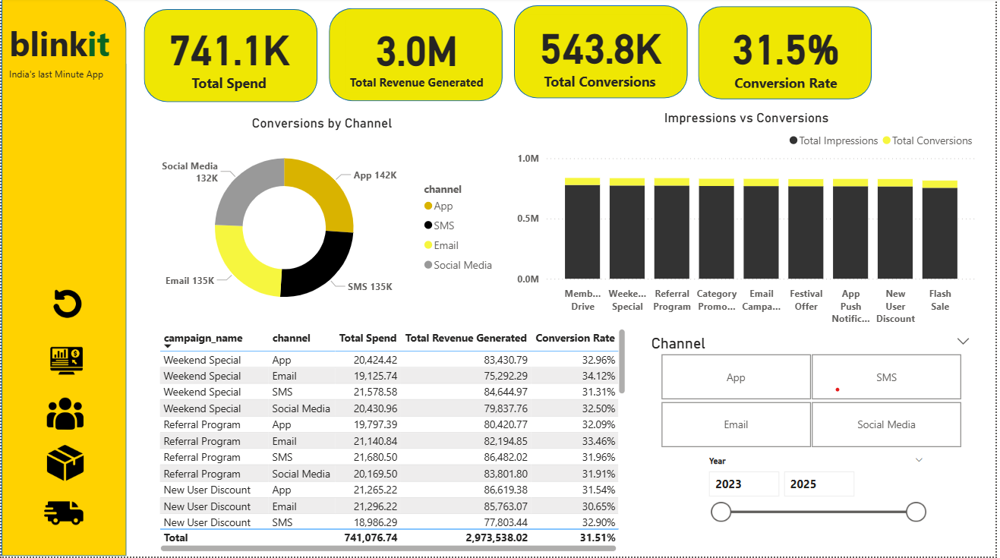

# 🛒 Blinkit Sales & Operations Analytics Dashboard

An interactive **Power BI analytics dashboard** built to analyze Blinkit’s business performance across sales, customers, products, delivery operations, and marketing campaigns.  

This project focuses on transforming raw business data into actionable insights using **Power BI, DAX, and Data Modeling**.

---

# 📌 Project Objectives

- Analyze overall sales and profitability trends
- Track customer purchasing behavior
- Identify top and low-performing products
- Monitor delivery efficiency and delays
- Evaluate marketing campaign effectiveness
- Build an interactive dashboard for business decision-making

---

# 📊 Dashboard Pages

## 1️⃣ Sales Overview
Provides a high-level business summary including:

- Total Revenue
- Total Orders
- Total Profit
- Monthly Sales Trend
- Category-wise Revenue Analysis
- Regional Performance Insights

### Key Insights
- Identified peak sales periods
- Compared category performance
- Analyzed revenue contribution across regions

---

## 2️⃣ Customer Analysis
Focuses on customer behavior and retention metrics.

### Features
- New vs Repeat Customers
- Revenue Contribution by Customer Type
- Customer Purchase Trends
- Customer Segmentation Analysis

### Key Insights
- Measured repeat customer contribution
- Identified loyal customer patterns
- Analyzed customer engagement trends

---

## 3️⃣ Product Analysis
Provides detailed product-level performance tracking.

### Features
- Top Performing Products
- Low Performing Products
- Product Category Analysis
- Drill-through from Category → Product Level

### Key Insights
- Identified best-selling products
- Detected underperforming inventory
- Compared category profitability

---

## 4️⃣ Delivery Performance
Analyzes operational and delivery efficiency.

### Features
- On-Time vs Delayed Deliveries
- Delivery Performance Trends
- Delivery Status Distribution
- Operational Efficiency KPIs

### Key Insights
- Tracked delivery delays
- Measured operational performance
- Identified areas for logistics improvement

---

## 5️⃣ Marketing Analysis
Measures the impact of promotions and campaigns.

### Features
- Campaign Performance Analysis
- Promotional Sales Impact
- Discount Effectiveness
- Revenue Generated from Campaigns

### Key Insights
- Evaluated campaign ROI
- Identified successful promotions
- Measured marketing-driven sales growth

---

# 🚀 Key Features

✅ Interactive Power BI Dashboard  
✅ Advanced DAX Measures for KPI Calculations  
✅ Drill-through Navigation  
✅ Dynamic Date Slicers  
✅ Business-focused Visualizations  
✅ Clean and Interactive UI  
✅ Data Modeling & Relationships  

---

# 🛠️ Tools & Technologies Used

| Tool | Purpose |
|------|----------|
| Power BI | Dashboard Development |
| DAX | KPI Calculations & Measures |
| Power Query | Data Cleaning & Transformation |
| Data Modeling | Relationship Building |
| Excel / CSV | Dataset Source |

---

# 📈 KPIs Tracked

- Total Revenue
- Total Orders
- Total Profit
- Profit Margin
- Repeat Customer Rate
- Top Products
- Delayed Deliveries
- Campaign Revenue
- Category Performance

---

# 📷 Dashboard Preview

## Sales Overview


## Customer Analysis


## Product Analysis


## Delivery Performance


## Marketing Analysis


---

# 💡 Business Impact

This dashboard enables businesses to:

- Make data-driven sales decisions
- Improve customer retention
- Optimize product strategy
- Reduce delivery inefficiencies
- Measure marketing effectiveness
- Monitor business KPIs in real time

---

# 📂 Project Structure

```bash
Blinkit-Sales-Analytics/
│
├── Dashboard.pbix
├── Images/
│   ├── Sales_overview.png
│   ├── Customer_analysis.png
│   ├── Product_analysis.png
│   ├── Delivery_analysis.png
│   └── Marketing_Analysis.png
│
└── README.md
```

---

# 👨‍💻 Author

## Sonal Gavali

Aspiring Data Analyst skilled in:

- Power BI
- SQL
- Excel
- Python
- Data Visualization
- Business Analytics

---

# ⭐ If You Like This Project

Feel free to:

- Star ⭐ the repository
- Fork 🍴 the project
- Connect on LinkedIn
- Share feedback

---
